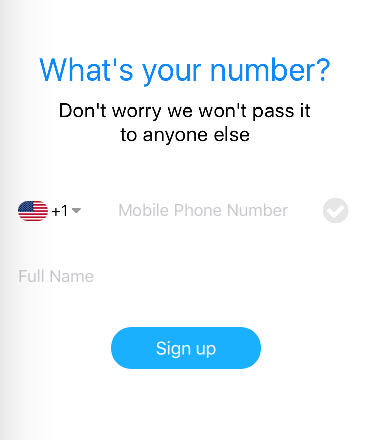
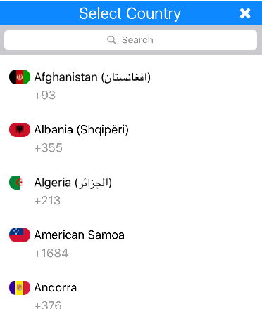
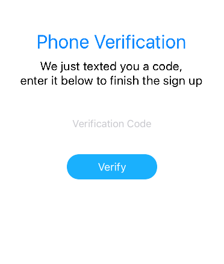

# NativeScript Phone Validator

This is a demo project for a phone number validation flow for NativeScript with ng2 (tested on 2.4). It assumes that the backend will use the international phonenumber (E164 format) as the username, but it can be completely customized.

The default flow is as follows:

1. Auto detect user country if possible (using [nativescript-telephony](https://github.com/roblav96/nativescript-telephony))
2. Ask user to enter phonenumber, fullname and select country (if needed)
3. Validate phonenumber is a valid cell phone number (using [google-libphonenumber](https://github.com/seegno/google-libphonenumber))
3. Register user in backend (not implemented)
4. Send SMS verification code (not implemented)
3. Present user with SMS verification code input
4. Login (not implemented)

##Usage

Just clone the repo and copy the relevant sections to your project.

##Screenshots

